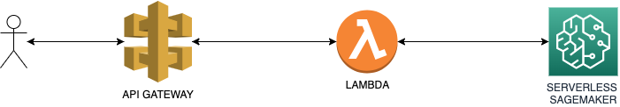

# HuggingFace on Serverless Sagemaker

Follow the steps in the (sagemaker) notebook [huggingface-on-serverless-sagemaker.ipynb](huggingface-on-serverless-sagemaker.ipynb)

- Load a model from huggingface hub and store on S3.
- Register a huggingface model as a Sagemaker model.
- Expose your HuggingFace Model to the Outside World.
- Create a lambda handler that gets the request and forwards it to the Sagemaker endpoint.
- Create a serverless.yml file to deploy our Serverless Sagemaker + Lambda + Api Gateway
- Deploy our stack to AWS
- Call our model using curl
- Remove the stack

finally this works now!

## Architecture

